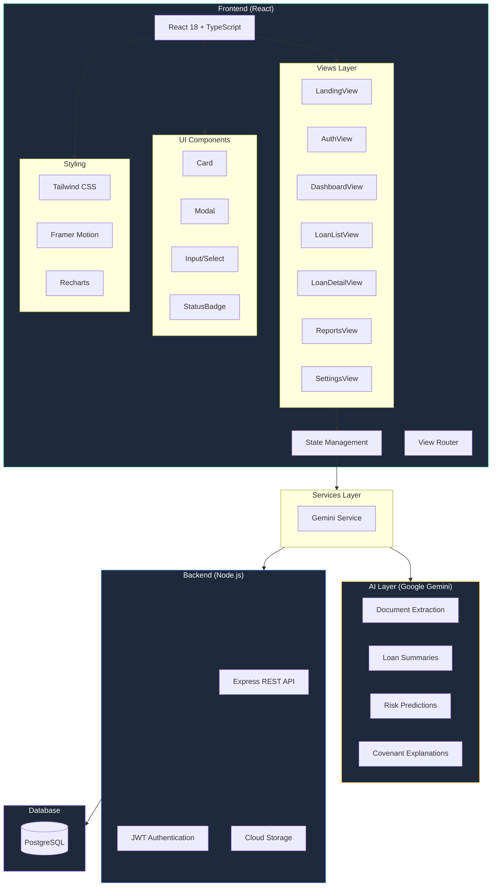
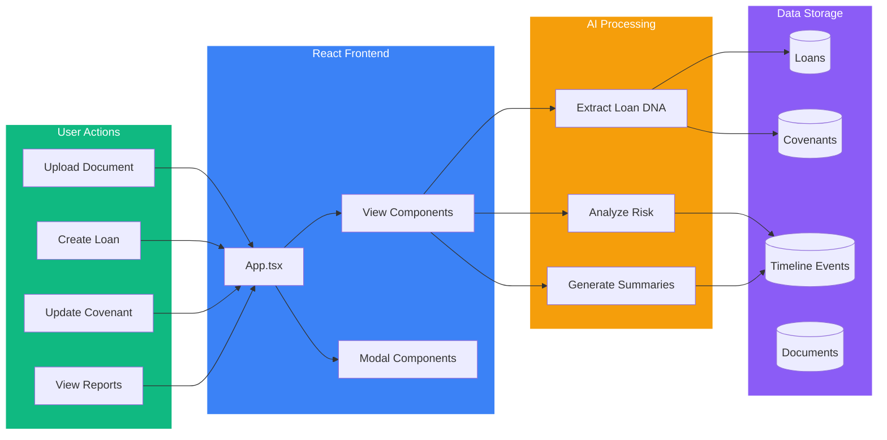
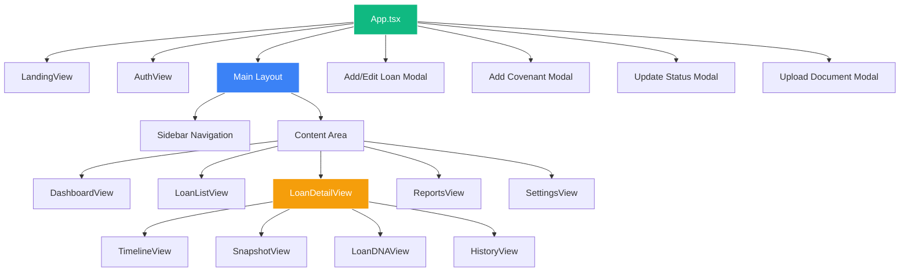
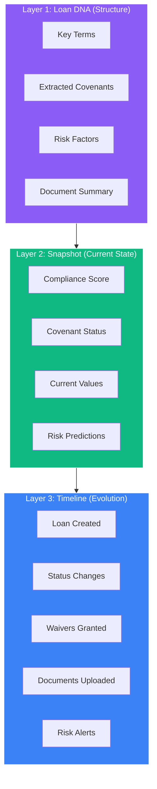
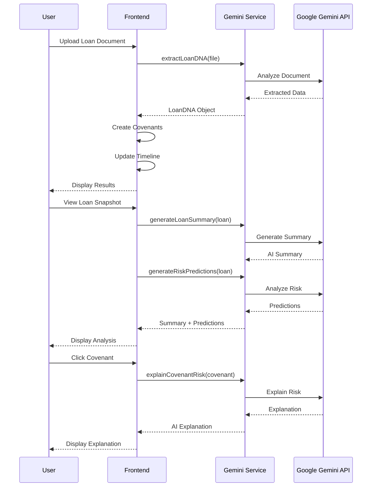

# Coven Architecture

## Tech Stack Diagram

```mermaid
flowchart TB
    subgraph Client["Frontend (React)"]
        UI[React 18 + TypeScript]
        State[State Management]
        Router[View Router]
        
        subgraph Views["Views Layer"]
            Landing[LandingView]
            Auth[AuthView]
            Dashboard[DashboardView]
            LoanList[LoanListView]
            LoanDetail[LoanDetailView]
            Reports[ReportsView]
            Settings[SettingsView]
        end
        
        subgraph Components["UI Components"]
            Card[Card]
            Modal[Modal]
            Input[Input/Select]
            Badge[StatusBadge]
        end
        
        subgraph Styling["Styling"]
            Tailwind[Tailwind CSS]
            Framer[Framer Motion]
            Recharts[Recharts]
        end
    end
    
    subgraph Services["Services Layer"]
        GeminiService[Gemini Service]
    end
    
    subgraph AI["AI Layer (Google Gemini)"]
        DocExtract[Document Extraction]
        Summary[Loan Summaries]
        RiskPredict[Risk Predictions]
        Explain[Covenant Explanations]
    end
    
    subgraph Backend["Backend (Node.js)"]
        API[Express REST API]
        AuthService[JWT Authentication]
        Storage[Cloud Storage]
    end
    
    subgraph Database["Database"]
        PostgreSQL[(PostgreSQL)]
    end
    
    UI --> Views
    UI --> Components
    UI --> Styling
    Views --> State
    State --> Services
    Services --> AI
    Services --> Backend
    Backend --> Database
    Backend --> Storage
    
    style Client fill:#1e293b,stroke:#10b981,color:#fff
    style AI fill:#1e293b,stroke:#f59e0b,color:#fff
    style Backend fill:#1e293b,stroke:#3b82f6,color:#fff
    style Database fill:#1e293b,stroke:#8b5cf6,color:#fff
```

## Data Flow Diagram

```mermaid
flowchart LR
    subgraph User["User Actions"]
        Upload[Upload Document]
        Create[Create Loan]
        Update[Update Covenant]
        View[View Reports]
    end
    
    subgraph Frontend["React Frontend"]
        App[App.tsx]
        Views[View Components]
        Modals[Modal Components]
    end
    
    subgraph Processing["AI Processing"]
        Extract[Extract Loan DNA]
        Analyze[Analyze Risk]
        Generate[Generate Summaries]
    end
    
    subgraph Storage["Data Storage"]
        Loans[(Loans)]
        Covenants[(Covenants)]
        Events[(Timeline Events)]
        Documents[(Documents)]
    end
    
    Upload --> App
    Create --> App
    Update --> App
    View --> App
    
    App --> Views
    App --> Modals
    
    Views --> Extract
    Views --> Analyze
    Views --> Generate
    
    Extract --> Loans
    Extract --> Covenants
    Analyze --> Events
    Generate --> Events
    
    style User fill:#10b981,stroke:#fff,color:#fff
    style Frontend fill:#3b82f6,stroke:#fff,color:#fff
    style Processing fill:#f59e0b,stroke:#fff,color:#fff
    style Storage fill:#8b5cf6,stroke:#fff,color:#fff
```

## Component Hierarchy

```mermaid
flowchart TD
    App[App.tsx]
    
    App --> Landing[LandingView]
    App --> Auth[AuthView]
    App --> Main[Main Layout]
    
    Main --> Sidebar[Sidebar Navigation]
    Main --> Content[Content Area]
    
    Content --> Dashboard[DashboardView]
    Content --> LoanList[LoanListView]
    Content --> LoanDetail[LoanDetailView]
    Content --> Reports[ReportsView]
    Content --> Settings[SettingsView]
    
    LoanDetail --> Timeline[TimelineView]
    LoanDetail --> Snapshot[SnapshotView]
    LoanDetail --> DNA[LoanDNAView]
    LoanDetail --> History[HistoryView]
    
    App --> LoanModal[Add/Edit Loan Modal]
    App --> CovenantModal[Add Covenant Modal]
    App --> StatusModal[Update Status Modal]
    App --> UploadModal[Upload Document Modal]
    
    style App fill:#10b981,stroke:#fff,color:#fff
    style Main fill:#3b82f6,stroke:#fff,color:#fff
    style LoanDetail fill:#f59e0b,stroke:#fff,color:#fff
```

## Three Layer Architecture

```mermaid
flowchart TB
    subgraph DNA["Layer 1: Loan DNA (Structure)"]
        Terms[Key Terms]
        ExtractedCov[Extracted Covenants]
        RiskFactors[Risk Factors]
        DocSummary[Document Summary]
    end
    
    subgraph Snapshot["Layer 2: Snapshot (Current State)"]
        Score[Compliance Score]
        Status[Covenant Status]
        Values[Current Values]
        Predictions[Risk Predictions]
    end
    
    subgraph Timeline["Layer 3: Timeline (Evolution)"]
        Created[Loan Created]
        Changes[Status Changes]
        Waivers[Waivers Granted]
        Uploads[Documents Uploaded]
        Alerts[Risk Alerts]
    end
    
    DNA --> Snapshot
    Snapshot --> Timeline
    
    style DNA fill:#8b5cf6,stroke:#fff,color:#fff
    style Snapshot fill:#10b981,stroke:#fff,color:#fff
    style Timeline fill:#3b82f6,stroke:#fff,color:#fff
```

## AI Integration Flow

```mermaid
sequenceDiagram
    participant U as User
    participant F as Frontend
    participant S as Gemini Service
    participant G as Google Gemini API
    
    U->>F: Upload Loan Document
    F->>S: extractLoanDNA(file)
    S->>G: Analyze Document
    G-->>S: Extracted Data
    S-->>F: LoanDNA Object
    F->>F: Create Covenants
    F->>F: Update Timeline
    F-->>U: Display Results
    
    U->>F: View Loan Snapshot
    F->>S: generateLoanSummary(loan)
    S->>G: Generate Summary
    G-->>S: AI Summary
    F->>S: generateRiskPredictions(loan)
    S->>G: Analyze Risk
    G-->>S: Predictions
    S-->>F: Summary + Predictions
    F-->>U: Display Analysis
    
    U->>F: Click Covenant
    F->>S: explainCovenantRisk(covenant)
    S->>G: Explain Risk
    G-->>S: Explanation
    S-->>F: AI Explanation
    F-->>U: Display Explanation
```
